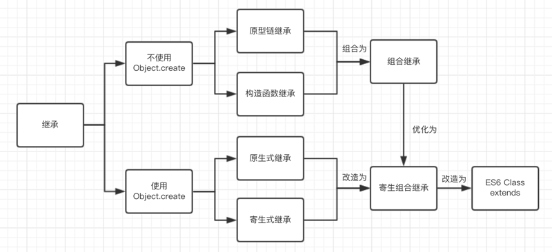

### 原型


1. 每个函数都有propertype属性
2. 每个对象都有__proto__属性 指向创建该对象的原型对象，__proto__将对象和原型连接起来形成了原型链，得以让对象访问到不属于自己的属性

new 的过程中产生的_proro_ 并链接到构造函数的原型上
```
function create(){
  let obj = new Object();
  let Con = [].shift.call(arguments)
  obj.__proto__ = Con.prototype
  let result = Con.apply(obj, arguments)
  return typeof result === 'object' ? result : obj 
}
```
```
function instanceof(left, right) {
    // 获得类型的原型
    let prototype = right.prototype
    // 获得对象的原型
    left = left.__proto__
    // 判断对象的类型是否等于类型的原型
    while (true) {
    	if (left === null)
    		return false
    	if (prototype === left)
    		return true
    	left = left.__proto__
    }
}
```
####总结
* `Object` 是所有对象的爸爸，所有对象都可以通过 `__proto__` 找到它
* `Function` 是所有函数的爸爸，所有函数都可以通过 `__proto__` 找到它
* `Function.prototype` 和 `Object.prototype` 是两个特殊的对象，他们由引擎来创建
* 除了以上两个特殊对象，其他对象都是通过构造器 `new` 出来的
* 函数的 `prototype` 是一个对象，也就是原型
* 对象的 `__proto__` 指向原型， `__proto__` 将对象和原型连接起来组成了原型链


###继承


